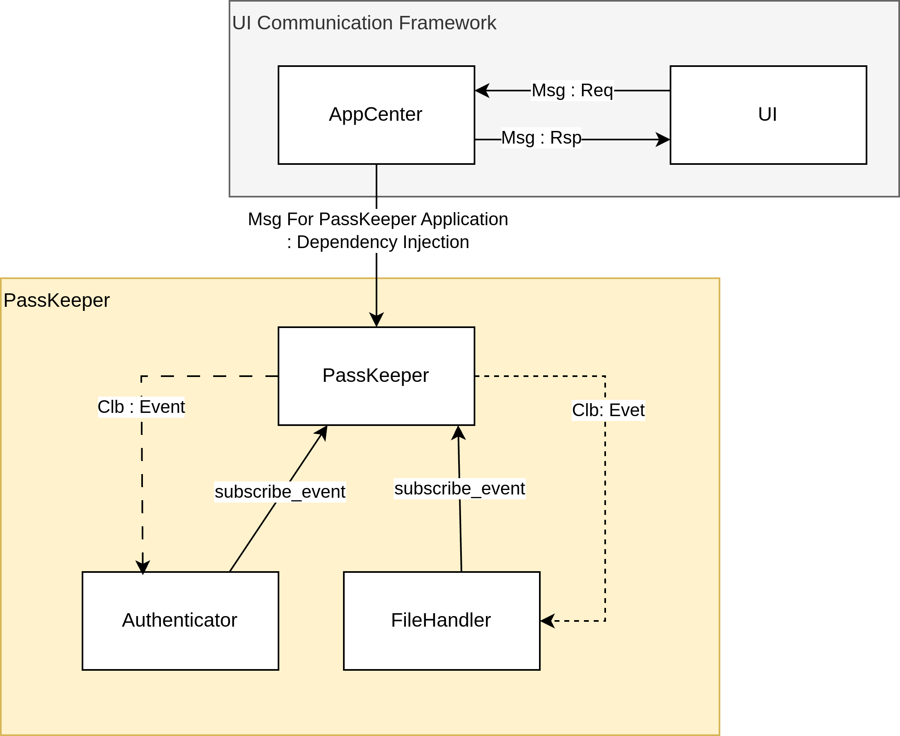

# PassKeeper

## Project Description
The Idea with this project is to create a console based executable where user can read list of his credentials from a xml file, read and add entry to the file through the UI Console.
The first step for user to authenticate 
the state machine illustrate the state of the application and the events available on the two states of IDLE and Service Available.

## Dependency

tinyxml2 Lib is used do the following steps to add it into your project  
<ol>
<li>Download latest release from: https://github.com/leethomason/tinyxml2 </li>
<li>unpack the zipped file </li>
<li>mkdir build</li>
<li> cmake .. </li>
<li> cd build</li>
<li> make</li>
<li> sudo make install </li>
</ol>
the lib should be added to usr/local/lib

## Architecture

